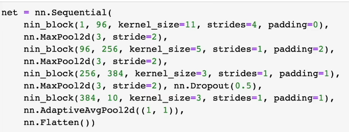

**深度学习——学习笔记**

核心是神经网络

内容


AI地图


应用

1.图片分类

 2.物体检测和分割

3.样式迁移

4.人脸合成

5.文字生成图片

6.文字生成

7.无人驾驶 

**一.数据操作和数据预处理**


宽：列的个数，高：行的个数

先列再行

创建数组

1.形状

2.每个元素的数据类型

3.每个元素的值

访问元素


[行：列：通道]或者[高：列：通道]

`import torch`

`x = torch.arange(n)`——生成一个0<=x<n的张量

`x.shape()`

`x.numel()`——访问张量的标量

`x.reshape()`——改变张量的形状先行再列(不改变其地址)

torch.cat((x,y),dim)——合并dim表示第多少维

dim=0表示在行合并

dim=1表示在列合并

通过逻辑运算符构建二元张量

广播机制

产生最大公倍数组

id发生新的变化

```python
before = id(Y)
Y = Y +X
id(Y) == before
```

结果：flase

执行原地操作

```python
z = torch.zeros_like(Y)
print('id(z):',id(z))
z[:] = X+Y
print('id(z):',id(z))
```

id未发生变化（减少内存开销）

```python
before = id(x)
x+=y#(x[:]=x+y)
id(x)==before
```

结果：true

转化为numpy张量


数据预处理

创建人工数据集，存在csv文件（逗号分隔）

```python
import os
import pandas as pd
#创建数据集
os.makerdirs(os.path.join('..','data'),exist_ok=True)
data_file = os.path.join('..','data','house_tint.csv')
#数据写入过程
#读取数据集
data = pd.read_csv(data_file)
#插值和删除——防止数据缺失
inputs，outputs = data.iloc[:,0:2],data.iloc[:,2]#(先行在列)
inputs = inputs.fillna(inputs.mean())
#对于inputs中的类别值或离散值，划分类别
inputs = pd.get_dummies(inputs,dummy_na=True)
```

**二.线性代数**

标量

1.简单操作

2.长度


向量

矩阵乘以向量

c=Ab（A的每一行的每个元素乘以b的第一元素求和等于c的元素）

矩阵乘以矩阵

C=AB（将B的每一列作为一个向量然后进行相乘的结果作为C元素的某一列）

范数


特殊矩阵

对称

Aij = Aji

反对称

Aij = -Aji

正定


正交和置换

特征向量：不被矩阵改变方向的向量

特征值：对称矩阵总能找到特征向量

标量由只有一个元素的张量表示

向量是标量值组成的列表

矩阵的转置

A.T

对称矩阵：A = A.T

行是倒数第二个维度，列是最后一个维度

复制：B = A.clone()

A.sum(axis=维度,keepdims=True(广播机制))——对某一维度进行求和

A.cumsum——A的累积总和

A.mean(axis=维度)——对某一维度进行求均值

**三.矩阵计算**

亚倒数


**四.自动求导**

计算图


显示构造tensorflow，theano，mxnet

```python
from mxnet import sym
a = sym.var()
b = sym.var()
```

隐式构造pytorch，mxnet

```python
from mxnet import autograd,nd
with autograd.record():
    a = nd.ones((2,1))
    b = nd.ones((2,1))
    c = 2*a+b
```

两种模式


x =torch.arange(4)

x.requires_grad_(True)

等价于x=torch.arange(4.0,requires_grad_=True)

torch.dot累积

通过调用反向传播函数计算y关于x每个分量的梯度

y.backward()

x.grad()

在默认情况下，pytorch会累积梯度，我们需要清除之前的值

固定参数

```python
x.grad.zero_()
y = x*x
u = y.detach()
z = u*x
z.sum().backward()
x.grad == u
```

**五.线性回归+基础优化算法**

底层原理类似于线性回归

简洁实现

通过深度学习框架简洁实现线性回归模型生成数据集

```python
import numpy as np
import torch
from torch.utils import data
from d2l import torch as d2l
true_w = torch.tensor([2,-3.4])
true_b = 4.2
features,labels = d2l.synthetic_data(true_w,true_b)
def load_array(data_arrays,batch_size,is_train=True):
    dataset = data.TensorDataset(*data_arrays)
    return data.DataLoader(dataset,batch_size,shuffle=is_train)
batch_size = 10
data_iter = load_array((features,labels),batch_size)
next(iter(data_iter))
from torch import nn
net = nn.Sequential(nn.Linear(2,1))
net[0].weight.data.normal_(0,0.01)
net[0].bias.data.fill_(0)
均方误差
loss = nn.MSELoss()
trainer = torch.optim.SGD(net.parameters(),lr=0.03)
```

**六.Softmax回归+损失函数+图片分类数据**

从回归到多类分类


损失函数

图像分类数据集

```python
%matplotlib inline
import torch
import torchvision
from torch.utils import data
from torchvision import transforms
from d2l import torch as d2l
d2l.use_svg_display()
```

batch_size为批量大小

读取一小批量数据，大小为batch_size

```python
batch_size = 256
def get_dataloader_workers():
    "使用4个进程来读取的数据"
    return 4
train_iter = data.DataLoader(mnist_train,batch_size,shuffle=True,num_workers=get_dataloader_workers())
timer = d2l.Timer()
for x,y in train_iter:
    continue
f'{timer.stop():.2f}sev'
```

定义 load_data_fashion_mnist函数进行数据读取

```python
def load_data_fashion_mnist(batch_size,resize=None)
'下载Fashion-MNIST数据集，然后将其加载到内存中'
trans = [transforms.ToTensor]
if resize:
   trans.insert(0,transforms.Resize(resize))
trans = transforms.Compose(trans)
mnist_train = torchvision.datasets.FashionMNIST(root="../data",train=True,transform=trans,download=True)
mnist_test = torchvision.datasets.FashionMNISTroot=("../data",train=True,transform=trans,download=True)
return (data.DataLoader(mnist_train,batch_size,shuffle=True,num_workers=get_dataloader_Workers())
data.DataLoader(mnist_test,batch_size,shuffle=False,num_workers=get_dataloader_workers()))
```

soltmax回归的从零开始实现

```python
import torch
from IPython import display
from d2l import torch as d2l
batch_size=256
#读取一个数据集，产生一个训练集和测试集的迭代器
train_iter,test_iter = d2l.load_data_fashion_mnist(batch_size)
num_inputs = 784
num_outputs = 10
W = torch.normal(0,0.01,size=(num_inputs,num_outputs),requires_grad=True)
b = torch.zeros(num_outputs,requires_grad=True)

```

实现softmax

```python
def softmax(x):
    x_exp = torch.exp(x)
    partition = x_exp.sum(1,keepim=True)
    return x_exp/partition
def net(x):
    return softmax(torch.matmul(x.reshape((-1,w.shape[0])),w)+b)
y = torch.tensor([0,2])
y_hat = torch.tensor([0.1,0.3,0.6],[0.3,0.2,0.5])
y_hat[[0,1],y]
def cross_entropy(y_hat,y):
    return -torch.log(y_hat[range(len(y_hat)),y])
cross_entropy(y_hat,y)
def accuracy(y_hat,y):
    "计算预测正确的数量"
    if len(y_hat.shape)>1 and y_hat.shape[1]:
        y_hat = y_hat.argmax(axis=1)
   	cmp = y_hat.type(y.dtype)==y
    return float(cmp.type(y.dtype).sum())
accuracy(y_hat,y)/len(y)
def evaluate_accuracy(net,data_iter):
    "计算在指定数据集上的模型的精度"
    if isinstance(net,torch.nn.Module):
        net.eval()
    metric = Accumulator(2)
    for x,y in data_iter:
    	metric.add(accuracy(net(x),y),y.numel())
  	return metric[0]/metric[1]
class Accumulator:
    "在n个变量上累加"
    def __init__(self,n):
        self.data = [0,0]*n
    def add(self,*args):
        self.data = [a+float(b)for a,b in zip(self.data,args)]
    def reset(self):
        self.data = [0,0]*len(self.data)
    def __getitem__(self,idx):
        return self.data[idx]
evaluate_accuracy(net,test_iter)

```

Softmax回归的训练

```python
def train_epoch_ch3(net,train_iter,loss,updater):
    if isinstance(net,torch.nn.Module):
        net.train()
    metric = Accumulator(3)
    for x,y in train_iter:
        y_hat = net(x)
        l = loss(y_hat,y)
    if isinstance(updater,torch.optim.Optimizer):
        updater.zero_grad()
        l.backward()
        updater.step()  						            metric.add(float(l)*len(y),accuracy(y_hat,y),y.size().numel())
    else:
        l.sum().backward()
        updater(x.shape[0])
        metric.add(float(l.sum()),accuracy(y_hat,y),y.numel())
     return metric[0]/metric[2],metric[1]/metric[2]      
```

soft回归简洁实现

```python
import torch
from torch import nn
from d2l import torch as d2l
batch_size =256
train_iter,test_iter = d2l.load_data_fashion_mnist(batch_size)
#调整网络输入的形状
net = nn.Sequential(nn.Flatten(),nn.Linear(784,10))
def init_weights(m):
    if type(m)==nn.Linear:
        nn.init.normal_(m.weight,std=0.01)
net.apply(init_weights)
loss = nn.CrossEntropyLoss()
trainer = torch.optim.SGD(net.parameters(),lr=0.1)
num_epochs = 10
d2l.train_ch3(net,train_iter,test_iter,loss,num_epochs,trainer)

```

**七.多层感知机+代码实现**

感知机


激活函数是人工神经网络中的一种函数，它负责将神经元的输入映射到输出端。激活函数的目的是向神经网络中引入非线性因素，使得神经网络能够拟合各种曲线。

Sigmoid激活函数

Tanh激活函数

将输入投影到（-1，1）


ReLU激活函数


Sigmoid函数：它将输入值映射到0和1之间，可以用来表示概率。它的优点是输出范围有限，梯度平滑，避免“跳跃”的输出值。但它也有一些缺点，如梯度消失问题（当输入值较大或较小时，梯度会变得很小），计算成本较高，且输出不以零为中心。

双曲正切（Tanh）函数：它将输入值映射到-1和1之间，输出以零为中心。它比Sigmoid函数更优越，因为它解决了输出不以零为中心的问题。但它仍然存在梯度消失问题。

修正线性单元（ReLU）函数：它在输入值为正时保持不变，在输入值为负时将其设为零。它的优点是解决了梯度消失问题，计算简单且快速。但它也存在神经元“死亡”的问题，即当输入值一直为负时，神经元不再对网络做出贡献。

代码实现

```python
import torch
from torch import nn
from d2l import torch as d2l
batch_size = 256
train_iter,test_iter = d2l.load_data_fashion_mnist(batch_size)
#数据决定输入层，效果决定输出层，隐藏层数自己决定
num_inputs,num_outputs,num_hiddens = 784,10,256
w1 = nn.Parameter(torch.randn(num_inputs,num_hiddens),requires_grad=True)
b1 = nn.Parameter(torch.zeros(num_hiddens,require_grad=True))
w2 = nn.Parameter(torch.randn(num_hiddens,num_outputs,require_grad=True))
b2 = nn.Parameter(torch.zeros(num_outputs,require_grad=True))
params = [w1,b1,w2,b2]
#实现ReLU激活函数
def relu(x):
    a = torch.zeros_like(x)
    return torch.max(x,a)
#实现模型
def net(x):
    x = x.reshape((-1,num_inputs))
    h = relu(x@w1+b1)
    return (h@w2+b2)
loss = nn.CrossEntropyLoss()
num_epochs,lr = 10,0.1
updater = torch.optim.SGD(params,lr=lr)
d2l.train_ch3(net,train_iter,test_iter,loss,num_epochs,updater)
```

简洁实现

```python
import torch
from torch import nn
from d2l import torch as d2l
net = nn.Sequential(nn.Flatten(),nn.Linear(784,256),nn.ReLU(),nn.Linear(256,10))
def init_weights(m):
    if type(m) == nn.Linear:
        nn.init.normal_(m.weight,std=0.01)
net.apply(init_weights);
batch_size,lr,num_epochs = 256,0.1,10
loss = nn.CrossEntroyLoss()
trainer = torch.optim.SGD(net.parameters(),lr=lr)
train_iter,test_iter = d2l.load_data_fashion_mnist(batch_size)
d2l.train_ch3(net,train_iter,test_iter,loss_num_epochs,updater)
```

**八.模型选择+过拟合和欠拟合**

训练误差：模型在训练数据上的误差

泛化误差：模型在新数据上的误差

验证数据集：一个用来评估模型好坏的数据集

例如拿出50%的训练数据

不要跟训练数据混在一起

测试数据集：只用一次的数据集

例如未来的考试

我出价的房子的实际成交价

用在Kaggle私有排行榜中的数据集

K-则交叉验证

在没有足够多数据时使用（这是常态）

算法：

将训练数据分割成K块

For i = 1,...,K

使用第i块作为验证数据集，其余的作为训练数据集

报告K 个验证集误差的平均

常用：K =5或10

模型参数
模型参数是指在训练过程中可以通过优化算法学习到的、用于决定模型预测值的内部变量。这些参数是模型的一部分，用于进行最终预测，因此它们的值在训练完毕后是固定的，不能再次修改。举个简单例子，对于线性回归模型，它的参数就是权重和截距，它们的值是在训练过程中被学习得到的。

下面是一个简单的线性回归模型：

```python
import numpy as np
from sklearn.linear_model import LinearRegression
#数据
X = np.array([[1, 1], [1, 2], [2, 2], [2, 3]])
y = np.dot(X, np.array([1, 2])) + 3
#模型训练
reg = LinearRegression().fit(X, y)
# 输出模型参数
print(reg.coef_)    # 输出：[1. 2.]
print(reg.intercept_)    # 输出：3.000000000000001
```

上述代码中，我们使用numpy生成一个2维数组作为输入数据，y是通过点积计算得到的，然后定义了一个线性回归模型，并在数据上进行训练（使用fit函数）。在训练完成后，我们通过调用coef_和intercept_属性获取模型的参数值。

超参数
超参数是指我们在模型开发过程中需要手动调整的参数。这些参数不能够被模型训练过程自动学习到，而是需要手动选择不同的值进行实验找到一个最优的值。常见的超参数包括学习率、迭代次数、正则化参数、决策树的深度等。

下面是一个简单的SVM模型：

```python
from sklearn.svm import SVC
from sklearn.datasets import load_iris
from sklearn.model_selection import train_test_split
from sklearn.metrics import accuracy_score
# 加载鸢尾花数据集
iris = load_iris()
X, y = iris.data, iris.target
# 切分数据集
X_train, X_test, y_train, y_test = train_test_split(X, y, test_size=0.2, random_state=42)
# 定义一个SVM模型
clf = SVC(C=1.0, kernel='rbf', gamma='auto')
# 训练模型
clf.fit(X_train, y_train)
# 预测并输出准确率
y_pred = clf.predict(X_test)
print("Accuracy: ", accuracy_score(y_test, y_pred))
```

上述代码中，我们使用sklearn库中的SVM模型对鸢尾花数据集进行分类，并通过train_test_split函数按照8:2的比例进行数据集划分。我们需要手动选择不同的超参数，例如C、kernel和gamma等。这些超参数的修改通常需要通过实验找到最优的值。

训练集、验证集和测试集

训练集：用来学习的样本集，用于分类器参数的拟合。

验证集：用来调整分类器超参数的样本集，如在神经网络中选择隐藏层神经元的数量。

测试集：仅用于对已经训练好的分类器进行性能评估的样本集。

验证集的作用：
使用验证集是为了快速调参，也就是用验证集选择超参数（网络层数，网络节点数，迭代次数，学习率等）。
另外用验证集还可以监控模型是否异常（过拟合等），然后决定是不是要提前停止训练。
验证集的关键在于选择超参数，我们手动调参是为了让模型在验证集上的表现越来越好，如果把测试集作为验证集，调参去拟合测试集，就有点像作弊了。
而测试集既 不参与参数的学习过程，也不参与参数的选择过程，仅仅用于模型评价。

验证集和测试集的区别


过拟合和欠拟合


给定一个模型的种类，将有两个主要因素

参数的个数

参数值的选择范围

数据的复杂度

多个重要因素

样本个数

每个样本的元素个数

时间、空间结构

多样性

代码实现

```python
import math
import numpy as np
import torch
from torch import nn
from d2l import torch as d2l
max_degree = 20
n_train,n_test = 100,100
true_w = np.zeros(max_degree)
true_w[0:4] = np.array([5,1.2,-3.4,5.6])
features = np.random.normal(size=(n_train+n_test,1))
np.random.shuffle(features)
poly_features = np.power(features,np.arange(max_degree).reshape(1,-1))
for i in range(max_degree):
    ploy_features[:,i]/=math.gamma(i+1)
labels = np.dot(ploy_features,true_w)
label+=np.random.normal(scale=0.1,size=labels.shape)
def evaluate_loss(net,data_iter,loss):
    "评估给定数据集上模型的损失"
    metric = d2l.Accumulator(2)
    for x,y in data_iter:
        out = net(x)
        y = y.reshape(out.shape)
        l = loss(out,y)
        metric.add(l.sum(),l.numel())
    return metric[0]/metric[1]
```

**九.权重衰退**

控制模型大小

1.控制参数多少

2.控制参数本身大小


权重衰退的实现

```python
import torch
from torch import nn
from d2l import torch as d2l
n_train,n_test,num_inputs,batch_size=20,100,200,5
true_w,true_b = torch.ones((num_inputs,1))*0.01,0.05
train_data_=d2l.synthetic_data(true_w,true_b,n_train)
train_iter=d2l.load_array(train_data,bathch_size)
test_data=d2l.synthetic_data(true_w,true_b,n_test)
test_iter=d2l.load_array(test_data,batch_size,is_train=False)
def init_params():
    w = torch.normal(0,1,size=(num_inputs,1),requires_grad=True)
    b = torch.zeros(1,requires_grad=True)
    return [w,b]
def 12_penalty(w):
    return torch.sum(w.pow(2))/2
def train(lambd):
    w,b = init_params()
    net,loss = lambda x:d2l.linreg(x,w,b),d2l.squared_loss
    num_epochs,lr=100,0.003
    #动画效果
    animator =d2l.Animator(xlabel='epochs',ylabel='loss',yscale='log',xlim=[5,num_epochs],legend=['train','test'])
    for epoch in range(num_epochs):
        for x,y in train_iter:
            l = loss(net(x),y)+lambd*12_penalty(w)
            l.sum().backward()
            d2l.sgd([w,b],lr,batch_size)
   	if (epoch+1)%5 ==0:
        animator.add(epoch+1,(d2l.evaluate_loss(net,train_iter,lr)
 d2l.evaluate_loss(net,test_iter,lr))
	print('w的L2范数是：'，torch.norm(w).item())
train(lambd=3)
```

简洁实现

```python
def train_concise(wd):
    net = nn.Sequential(nn.Linear(num_inputs,1))
    for param in net.parameters():
        param.data.normal_()
  	loss = nn.MSELoss()
    num_epochs,lr=100,0.003
    trainer=torch.optim.SGD([{
        "params":net[0].weight,
        "weight_decay":wd}{
        "params":net[0].bias}],lr=lr)
    animator = d2l.Animator(xlabel='epochs',ylabel='loss',scale='log',xlim=[5,num_epochs],legend='train','test')
    for epoch in range(num_epochs):
        for x,y in train_iter:
            with torch.enable_grad():
                trainer.zero_grad()
                l = loss(net(x),y)
          	l.backward()
            trainer.step()
```

**十.丢弃法**

一个好的模型需要对输入数据的扰动鲁棒

使用有噪音的数据等价于Tikonov正则

丢弃法：在层之间加入噪音

正则项只在训练中使用：他们影响模型参数的更新

在推理过程中，丢弃法之间返回输入

h=dropout(h)

这样也能保证确定性的输出

丢弃法将一些输出项随机置0来控制模型复杂度

常作用在多层感知机的隐藏层输出上

丢弃概率是控制模型复杂度的超参数

代码实现

```python
import torch 
from torch import nn
from d2l import torch as d2l
def dropout_layer(x,dropout):
    assert 0 <=dropout <=1
    if dropout ==1:
        return torch.zeros_like(x)
    if dropout ==0:
        return x
    mask = (torch.Tensor(x.shape).uniform_(0,1)>dropout).float
    return mask * x/(1.0-dropout)
x=torch.arange(16,dtype=torch.float32).reshape((2,8))
num_inputs,num_outputs,num_hiddens1,num_hiddens2=784,10,256,256
dropout1,dropout2=0.2,0.5
class Net(nn.Module):
    def __init__(self,num_inputs,num_outputs,num_hiddens1,num_hiddens2,is_training=True):
        super(Net,self).__init__()
        self.num_inputs = num_inputs
        self.training=is_training
        self.lin1 = nn.Linear(num_inputs,num_hiddens1)
        self.lin2 =	nn.Linear(num_hiddens1,num_hiddens2)
        self.lin3 = nn.Linear(num_hiddens2,num_outputs)
        self.relu = nn.ReLU()
 	def forward(self,x):
        H1 = self.relu(self.lin1(x.reshape((-1,self.num_inputs))))
        if self.training ==True:
            H1=dropout_layer(H1,dropout1)
        H2 = self.relu(self.lin2(H1))
        if self.training == True:
            H2 = dropout_layer(H2,dropout2)
       	out = self.lin3(H2)
        return out
```

简洁实现

```python
net=nn.Sequential(nn.Flatten(),nn.Linear(784,256),nn.ReLU(),nn.Dropout(dropout1),nn.Linear(256,256),nn.ReLU(),nn.Dropout(dropout2),nn.Linear(256,10))
def init_weights(m):
    if type(m)==nn.Linear:
        nn.init.normal(m.weight,std=0.1)
net.apply(n=init_weights);
trainer=torch.optim.SGD(net.parameters(),lr=lr)
d2l.train_ch3(net,train_iter,test_iter,loss,num_epochs,updater)
```

net=nn.Sequential(nn.Flatten(),nn.Linear(784,256),nn.ReLU(),nn.Dropout(dropout1),nn.Linear(256,256),nn.ReLU(),nn.Dropout(dropout2),nn.Linear(256,10))：这一行定义了一个神经网络模型，它包含一个输入层，两个隐藏层和一个输出层。输入层使用nn.Flatten()将输入数据展平。隐藏层和输出层使用nn.Linear()定义线性变换，其中第一个隐藏层有256个神经元，第二个隐藏层也有256个神经元，输出层有10个神经元。隐藏层之间使用nn.ReLU()作为激活函数，并使用nn.Dropout()进行随机失活。

def init_weights(m): if type(m)==nn.Linear: nn.init.normal(m.weight,std=0.1)：这几行定义了一个函数init_weights，它用于初始化网络中的权重。如果传入的模块是线性层，则使用正态分布初始化权重，标准差为0.1。

net.apply(init_weights);：这一行调用apply方法，将init_weights函数应用于网络中的每个模块，以初始化权重。

trainer=torch.optim.SGD(net.parameters(),lr=lr)：这一行定义了一个优化器，用于更新网络的权重。优化器使用随机梯度下降算法，学习率为lr。

d2l.train_ch3(net,train_iter,test_iter,loss,num_epochs,updater)：这一行调用了d2l.train_ch3函数，对网络进行训练。传入的参数包括网络模型、训练数据迭代器、测试数据迭代器、损失函数、训练轮数和更新函数。

**十一.模型稳定性+模型初始化和激活函数**

——梯度爆炸的问题

值超出值域（对于16位浮点数尤为严重）

对于学习率敏感

如果学习率太大->大参数值->更大的梯度

如果学习率太小->训练无进展

我们需要在训练过程中不断调整学习率

——梯度消失的问题

梯度值变成0（对16位浮点数尤为严重）

训练没有进展（不管如何选择学习率）

对于底部层尤为严重（仅仅顶部层训练的较好，无法训练交深的神经网络）

让训练更加稳定

Xavier初始


检查常用激活函数

合理的权重初始值和激活函数的选取可以提升数值稳定性

**十二.Pytorch神经网络基础**

 层和块

```python
import torch
from torch import nn
from torch.nn import functional as F
net = nn.Sequential(nn.Linear(20,256),nn.ReLU(),nn.Linear(256,10))
x = torch.rand(2,20)
net(x)
class MLP(nn.Module):
    def __init__(self):
        super().__init__()
        self.hidden = nn.Linear(20,256)
        self.out = nn.Linear(256,10)
   	def forward(self,x):
       	return self.out(F.relu(self.hidden(x)))
net = MLP()
net(x)
class MySequential(nn.Module):
    def __init__(self,*args):
        super().__init__()
        for block in args:
            self._modules[block]=block
  	def forward(self,x):
        for block in self._modules.values():
            x = block(x)
       	return x
net = MySequential(nn.Linear(20,256),nn.ReLU(),nn.Linear(256,10))
net(x)
```

混合搭配各种组合块的方法

```python
class NestMLP(nn.Module):
    def __init__(self):
        super().__init__()
        self.net == nn.Sequential(nn.Linear(20,64),nn.ReLU(),nn.Linear(64,32),nn.ReLU())
        self.linear = nn.Linear(32,16)
   	def forward(self,x):
        return self.linear(self.net(x))
chimera = nn.Sequential(NestMLP(),nn.Linear(16,20),FixedHiddenMLP())
chimera(x)

```

线性层，也称为全连接层或密集层，是一种常用的神经网络层。它接受一个输入张量，通过一个矩阵乘法和一个偏置向量相加的方式计算输出张量，其中矩阵和偏置向量是线性层的可学习参数。

线性层可以将输入张量投影到一个更高维度的空间中，从而提高模型的表现能力。在深度学习中，线性层常用于实现神经网络的前向传播，通常与非线性激活函数（如 ReLU）配合使用，以增强模型的非线性表达能力。

参数管理

```python
import torch
from torch import nn
net = nn.Sequential(nn.Linear(4,8),nn.ReLU(),nn.Linear(8,1))
x = torch.rand(size=(2,4))
net(x)
print(net[2].state_dict())#某层的转态按序列
print(type(net[2].bias))#最后一层的偏移的类别
print(net[2].bias)#最后一层的偏移
print(net[2].bias.data)#最后一层偏移量
net[2].weight.grad#梯度
#一次性访问所有参数
print(*[(name,param.shape) for name,param in net[0].named_parameters()])
print(*[(name,param.shape) for name,param in net.named_parameters()])
net.state_dict()['2.bias'].data
def block1():
    return nn.Sequential(nn.Linnear(4,8),nn.ReLU(),nn.Linear(8,4),nn.ReLU())
def block2():
    net = nn.Sequential()
    for i in range(4):
        net.add_module(f'block{i}',block1())
    return net
rgnet = nn.Sequential(block2(),nn.Linear(4,1))
rgnet(x)
#内置初始化
def init_normal(m):
    if type(m)==nn.Linear:
        nn.init.normal_(m.weight,mean,std=0.01)
        nn.init.zeros_(m.bias)
net.apply(init_normal)
net[0].weight.data[0],net[0].bias.data[0]
def init_constant(m):
    if type(m)==nn.Linear:
        nn.init.constant_(m.weight,1)
        nn.init.zeros_(m.bias)
net.apply(init_constant)
net[0].weight.data[0],net[0].bias.data[0]
#对某些块应用不同的初始化方法
def xavier(m):
    if type(m)==nn.Linear:
        nn.init.xavier_uniform_(m.weight)
def init_42(m):
    if type(m) == nn.Linear:
        nn.init.constant_(m.weight,42)
net[0].apply(xavier)
net[2].apply(init_42)
print(net[0].weight.data[0])
print(net[2].weight.data)
#自定义初始化
def my_init(m):
    if type(m)==nn.Linear:
        print("Init",
             *[(name,param.shape) for name,param in m.named_parameters()][0])
        nn.init.uniform_(m.weight,-10,10)
        m.weight.data *= m.weight.data.abs() >=5
net.apply(my_init)
net[0].weight[:2]
#参数绑定
shared = nn.Linear(8,8)
net = nn.Sequential(nn.Linear(4,8),nn.ReLU(),shared,nn.ReLU(),nn.Linear(8,1))
net(x)
print(net[2].weight.data[0]==net[4].weight.data[0])
net[2].weight.data[0,0]=100
print(net[2].weight.data[0] ==net[4].weight.data[0])
```

自定义层

```python
import torch
import torch.nn.functional as F
from torch import nn
class CenteredLayer(nn.Module):
    def __init__(self):
        super().__init__()
   	def forward(self,x):
        return x-x.mean()
layer = CenteredLayer()
layer(torch.FloatTensor([1,2,3,4,5]))
#将层作为组件合并到构建更复杂的模型中
net = nn.Sequential(nn.Linear(8,10),CenteredLayer())
Y = net(torch.rand(4,8))
Y.mean()
#带参数的图层
class MyLinear(nn.Module):
    def __init__(self,in_units,units):
        super().__init__()
        self.weight = nn.Parameter(torch.randn(in_units,units))
        self.bias =nn.Parameter(torch.randn(units,))
   	def forward(self,x):
        linear = torch.matmul(x,self.weight.data)+self.bias.data
        return F.relu(linear)
dense = MyLinear(5,3)
dense.weight
dense(torch.rand(2,5))
net = nn.Sequential(MyLinear(64,8),Mylinear(8,1))
net(torch.rand(2,64))
```

读写文件

加载和保存张量

```python
import torch
from torch import nn
from torch.nn import functional as F
#存储一个张量列表，然后把它们读回内存
x = torch.arange(4)
torch.save(x,'x-file')
x2 = torch.load("x-file")
x2
#写入或读取从字符串映射到张量的字典
mydict = {'x':x,'y':y}
torch.save(mydict,'mydict')
mydict2 = torch.load('mydict')
mydict2
#加载和保存模型参数
class MLP(nn.Module):
    def __init__(self):
        super().__init__()
        self.hidden = nn.Linear(20,256)
        self.output = nn.Linear(256,10)
 	def forward(self,x):
        return self.output(F.relu(self.hidden(x)))
net = MLP()
x = torch.randn(size=(2,20))
y = net(x)
#将模型的参数存储为一个叫做"mlp.params"文件
torch.save(net.state_dict(),'mlp.params')
#load_实例化了原始多层感知机模型的一个备份。直接读取文件中存储的参数
clone = MLP()
clone.load_state_dict(torch.load("mlp.params"))
clone.eval()
y_clone = clone(x)
y_clone = y
```

**十三.使用和购买GPU**

检验是否有GPU

！nvidia-smi

```python
#计算设备
import torch
from torch import nn
torch.device('cpu'),torch.cuda.device('cuda'),torch.cuda.device('cuda:1')
#查询可用GPU的数量
torch.cuda.device_count()
def try_gpu(i=0):
    """如果存在，则返回GPU(i),否则返回cpu()"""
    if torch.cuda.device_count() >=i+1:
        return torch.device(f'cuda:{i}')
    return torch.device('cpu')
def try_all_gpus():
"""返回所有可用的GPU，如果没有GPU则返回[cpu()]"""
devices = [torch.device(f'cuda:{i}) for i in range(torch.cuda.device('cpu'))]
  	return devices if devices else [torch.device('cpu')]
try_gpu(),try_gpu(10),try_all_gpus()
#查询张量所在的设备
x=torch.tensor([1,2,3])
x.device
#存储在GPU上
x=torch.ones(2,3,device=try_gpu())
y = torch.rand(2,3,device=try_gpu(1))
#将在第1个GPU上面的变量移动到第2个gpu上面
z=x.cuda(1)
#神经网络与GPU
net = nn.Sequential(nn.Linear(3,1))
net = net.to(device=try_gpu())
#确认模型参数存储上同一个GPU
net[0].weight.data.device                       
```

购买GPU

**十四.卷积层**

从全连接层到卷积

——两个原则

平移不变性

局部性

卷积层

交叉相关和卷积由于对称性，在实际使用中没有区别

卷积层将输入和核矩阵进行交叉相关，加上偏移后得到输出

核矩阵和偏移是可学习的参数

核矩阵的大小是超参数

图像卷积代码实现

```python
import torch
from torch import nn
from d2l import torch as d2l
def corr2d(x,k):
    """计算二维互相关运算"""
    h,w = k.shape
    y = torch.zeros(x.shape[0]-h,x.shape[1]+1)
    for i in range(y.shape[0]):
        for j in range(y.shape[1]):
            y[i,j] = (x[i:i+h,j:j+w]*k).sum()
	return y
#实现二维卷积层
class Con2D(nn.Module):
    def __init__(self,kernel_size):
        super().__init__()
        self.weight = nn.Parameter(torch.rand(kernel_size))
        self.bias = nn.Parameter(torch.zeros(1))
  	def forward(self,x):
        return corr2d(x,self.weight)+self.bias
#学习由x生成y的卷积核
conv2d = nn.Conv2d(1,1,kernel_size=(1,2),bias=False)
x = x.reshape((1,1,6,8))#通道数，批量大小数
y = y.reshape((1,1,6,7))
for i in range(10):
    y_hat = conv2d(x)
    l = (y_hat-y)**2
    conv2d.zero_grad()
    l.sum().backgrad()
    conv2d.weight.data[:] -=3e-2*conv2d.weight.grad
    if (i+1)%2==0:
        print(f'batch{i+1},loss{l.sum():.3f}')
```

**十五.卷积层里的填充和步幅**

填充

在输入周围添加额外的行和列

填充大小

步幅

填充大小的输出大小与层数线性相关

给定输入大小224*224，在使用5×5卷积核的情况下，需要44层将输出降低到4×4

需要大量计算才能得到较小输出

步幅是指行和列的滑动步长

输出大小

填充和步幅是卷积层的超参数

填充在输入周围添加额外的行和列，来控制输出形状的减少量

步幅是每次滑动核窗口时的行和列的步长，可以成倍的减少输出形状

代码实现

```python
import torch 
from torch import nn
def comp_conv2d(conv2d,x):
    x = x.reshape((1,1)+x.shape)
    y = conv2d(x)
    return y.reshape(y.shape[2:])
conv2d = nn.Conv2d(1,1,kernel_size=3,padding=1)
x = torch.rand(size=(8,8))
comp_conv2d(conv2d,x).shape
conv2d = nn.Conv2d(1,1,kernel_size=(5,3),padding=(2,1))
comp_conv2d(conv2d,x).shape
conv2d = nn.Conv2d(1,1,kernel_size=3,padding=1,stride=2)
comp_conv2d(conv2d,x).shape
conv2d = nn.Conv2d(1,1,kernel_size=(3,5),padding=(0,1),stride=(3,4))
```

**十六.卷积层里多个输入和输出通道**

多个输入通道

彩色图像可能有RGB三个通道

转换为灰度会丢失信息

每个通道都有一个卷积核，结果是所有通道卷积结果的和

计算

每个输出通道可以识别特定模式

输入通道核识别并组合输入中的模式

卷积层是计算量较大，但模型大小较小

输出通道数是卷积层的超参数

每个输入通道都有独立的二维卷积核，所有通道结果相加得到一个输出通道结果

每个输出通道有独立的三维卷积核

代码实现

```python
import torch
from d2l import torch as d2l
def corr2d_multi_in(x,k):
    return sum(d2l.corr2d(x,k) for x,k in zip(x,k))
def corr2d_multi_in_out(x,k):
    return torch.stack([corr2d_multi_in(x,k) for k in k],0)
k = torch.stack((k,k+1,k+2),0)
k.shape
#1*1的卷积
def corr2d_multi_in_out_1×1(x,k):
    c_i,h,w =x.shape
    c_o = k.shape[0]
    x = x.reshape((c_i,h*w))
    k = k.reshape((c_o,c_i))
    y = torch.matmul(k,k)
    return y.reshape((c_o,h,w))
x = torch.normal(0,1,(3,3,3))
k = torch.normal(0,1,(2,3,1,1))
y1 = corr2d_multi_in_out_1×1(x,k)
y2 = corr2d_multi_in_out(x,k)
assert float(torch.abs(y1-y2).sum())<1e-6
#调用(前者为输入，后者为输出)
conv2d = nn.Conv2d(1,1,kernel_size=3,padding=1,stride=2)
conv2d = nn.Conv2d(1,1,kernel_size=(3,5),padding=(0,1),stride=(3,4))
```

**十七.池化层**

积对位置敏感检测垂直边缘

需要一定程度的平移不变性

二维最大池化——返回滑动窗口中的最大值

max(a,b,c,d)

池化层与卷积层类似，都具有填充和步幅

没有可学习的参数

在每个输入通道应用池化层以获得相对应的输出通道

输出通道数=输入通道数

平均池化层

最大池化层：每个窗口中最强的模式信号

平均池化层：将最大池化层中的“最大”操作替换为“平均”

总结：

池化层返回窗口中最大或平均值

缓解卷积层会位置的敏感性

同样有窗口大小、填充和步幅作为超参数

代码实现

```python
import torch
from torch import nn
from torch import torch as d2l
def pool2d(x,pool_size,mode='max'):
    p_h,p_w = pool_size
    y = torch.zeros((x.shape[0]-p_h+1,x.shape[1]-p_w+1))
    for i in range(y.shape[0]):
        for j in range(y.shape[1]):
            if mode =='max':
                y[i,j]=x[i:i+p_h,j:j+p_w].max()
            elif mode =='avg':
                y[i,j]=x[i:i+p_h,j:j+p_w].mean()
  	return y 
#填充和步幅
x = torch.arange(16,dtype=torch.float32).reshape((1,1,4,4))
#深度学习框架中的步幅与池化层窗口的大小相同
pool2d = nn.MaxPool2d(3)
pool2d(x)
pool2d = nn.MaxPool2d((2,3),padding=1,stride=2)
#先是池化层大小，然后是填充大小，最后是步幅大小
x = torch.cat((x,x+1),1)
#通道
#通常池化层是放在卷积层后面
```

**十八.经典卷积神经网络LeNet**

MNIST

50000个训练数据

10000个测试数据

图像大小28*28

10类

LeNet结构


先用卷积层学习图片空间信息

然后使用全连接层来转换类别空间

代码实现

```python
import torch 
from torch import nn
from torch import torch as d2l
class Reshape(torch.nn.Module):
    def forward(self,x):
        return x.view(-1,1,28,28)
net = torch.nn.Sequential(
	  Reshape(),nn.Conv2d(1,6,kernel_size=5,padding=2,nn.Sigmoid(),nn.AvgPool2d(kernel_size=2,stride=2)nn.Conv2d(6,16,kernel_size=5),nn.Flatten(),nn.Linear(16*5*5,120),nn.Sigmoid(),nn.Linear(120,84),nn.Sigmoid(),nn.Linear(84,10)))
#检测模型
x = torch.rand(size=(1,1,28,28),dtype=torch.float32)
for layer in net:
    x = layer(x)
    print(lay.__class__.__name__,'output shape\t',x.shape)
#使用GPU计算模型在数据集上的精度
def evaluate_accuracy_gpu(net,data_iter,device=None):
    if isinstance(net,torch.nn.Module):
        net.eval()
     	if not device:
            device = next(iter(net.parameters())).device
 	metric = d2l.Accumulator(2)
    for X,y in data_iter:
        if isinstance(x,list):
            X = [x.to(device) for x in X]
        else:
            X = X.to(device)
       	y = y.to(device)
        metric.add(d2l.accuracy(net(X),y),y.numel())
        return metric[0]/metric[1]
def train_ch6(net,train_iter,test_iter,num_epochs,lr,device):
    """Train a model with a GPU(defined in Chapter 6)"""
    def init_weights(m):
        if type(m)==nn.Linear or type(m) ==nn.Conv2d:
       		nn.init.xavier_uniform_(m.weight)
  	net.apply(init_weights)
    print('training on',device)
    net.to(device)
    optimizer = torch.optim.SGD(net.parameters(),lr=lr)
    loss = nn.CrossEntropyLoss()
    animator = d2l.Animator(xlabel='epoch',xlim=[1,num_epochs],legend=['train loss','train acc','test acc'])
    timer,num_batches = d2l.Timer(),len(train_iter)
    for epoch in  range(num_epochs):
        metric = d2l.Accumulator(3)
        net.train()
        for i,(x,y) in enumerate(train_iter):
            timer.start()
            optimizer.zero_grad()
            x,y =x.to(device),y.to(device)
            y_hat = net(x)
            l = loss(y_hat,y)
            l.backward()
            optimizer.step()
            metric.add(l*x.shape[0],d2l.accuracy(y_hat,y),x.shape[0])
            timer.stop()
            train_1 = metric[0]/metric[2]
            train_acc = metric[1]/metric[2]
            if (i+1)%(num_batches//5)==0 or i ==num_batches:
                animator.add(epoch+(i+1)/num_batches,(train_1,train_acc,None))
      	test_acc = evaluate_accuracy_gpu(net,test_iter)
      	animator.add(epoch+1,(None,None,test_acc))
	print(f'loss{train_1:.3f},train acc{train_acc:.3f},'
          f'test acc{test_acc:.3f}')
    print(f'{metric[2]*num_epochs/timer.sum():.1f}examples/sec'
       f'on{str(device)}')
```

**十九.深度卷积神经网络AlexNet**

特征提取

选择核函数来计算特征

凸优化问题

漂亮的定理

ImageNet

图片			自然物体的彩色图片			手写数字的黑白图片

大小				469×387								28×28		

样本数				1.2M									60K
类数					1000									10

AlexNet架构

更大的池化窗口，使用最大池化层

更大的核窗口和步长，因为图片更大了

激活函数从sigmoid变成了ReLu(减缓梯度消失)

隐藏全连接层后加入了丢弃层

数据增强

代码实现

```python
import torch 
from torch import nn
from d2l import torch as d2l
net = nn.Sequential(
				  	nn.Conv2d(1,96,kernel_size=11,stride=4,padding=1),nn.ReLU(),
    				nn.MaxPool2d(kernel_size=5,padding=2),nn.ReLU(),
				 	nn.Conv2d(96,256,kernel_size=5,padding=2),nn.ReLU(),
 				   	nn.MaxPool2d(kernel_size=3,stride=2),nn.ReLU(),		 			 		 		   				nn.Conv2d(256,384,kernel_size=3,padding=1),nn.ReLU(),
    				nn.Conv2d(384,384,kernel_size=3,padding=1),nn.ReLU(),
    				nn.Conv2d(384,256,kernel_size=3,padding=1),nn.ReLU(),
    				nn.MaxPool2d(kernel_size=3,stride=2),nn.Flatten(),
    				nn.Linear(6400,4096),nn.ReLU(),nn.Dropout(p=0.5),
    				nn.Linear(4096,4096),nn.ReLU(),nn.Dropout(p=0.5),nn.Linear(4096,10)
)
```

**二十.使用块的网络VGG**

使用VGG块

深但窄效果更好

3*3卷积（填充1）（n层m通道）

2*2最大池化层（步幅2）

架构

多个VGG块后接全连接层

不同次数的重复块得到不同的架构VGG16，VGG19

VGG使用可重复使用的卷积块来构建深度卷积神经网络

不同的卷积块个数和超参数可以得到不同复杂度的变种

代码实现

VGG块

```python
import torch
from torch import nn
from d2l import torch as d2l
def vgg_block(num_convs,in_channels,out_channels):
    layers=[]
    for _ in range(num_convs):
        layers.append(nn.Conv2d(in_channels,out_channels,kernel_size=3,padding=1))
        layers.append(nn.ReLU())
        in_channels = out_channels
  	layers.append(nn.MaxPool2d(kernel_size=2))
    return nn.Sequential(*layers)
conv_arch = ((1,64),(1,28),(2,256),(2,512),(2,512))
def vgg(con_arch):
    conv_blks = []
    in_channels =1
    for (num_convs,out_channels) in conv_arch:
        conv_blks.append(vgg_block(
        num_convs,in_channels,out_channnels))
        in_channels = out_channels
  	return nn.Sequential(*conv_blks,nn.Flatten(),nn.Linear(out_channels*7*7,4096),nn.ReLU(),nn.Dropout(0.5),nn.Linear(4096,4096),nn.ReLU(),nn.Dropout(0.5),nn.Linear(4096,10))
net = vgg(conv_arch)
```

**二十一.网络中的网络NiN**

NiN块

一个卷积层后面跟着两个全连接层

步幅1，无填充，输出形状跟卷积层输出一样

起到全连接层的作用

NiN架构

无全连接层

交替使用NiN块和步幅为2的最大池化层

逐步减小高宽和增大通道数

最后使用全局平均池化层得到输出

其输入通道数是类别数

总结

NiN块使用卷积层加两个1×1卷积层，后者对每个像素增加了非线性性

NiN使用全局平均池化层来代替VGG和AlexNet的全连接层

不容易过拟合，更少的参数个数

代码实现

```python
import torch
from torch import nn
from d2l import torch as d2l
def nin_block(in_channels,out_channels,kernel_size,strides,padding)
return nn.Sequential(nn.Conv2d(in_channels,out_chanels,kernel_size,strides),nn.ReLU(),nn.Conv2d(out_channels,out_channels,kernel_size=1),nn.ReLU(),nn.Conv2d(out_channels,outchannels,kernel_size=1),nn.ReLU())
```

NiN模型



**二十二.含并行连结的网络(GoogleNet）**

4个路径从不同层面抽取信息，然后在输出通道维合并

使用不同窗口大小的卷积层

跟输入等同高宽

使用池化层

框架：


第一个Inception块，图示通道数

降低通道数来控制模型复杂度

每条路上通道数可能不同

1.2.更小的窗口，更多的通道

3.通道分配不同，输出通道增加

4.5.增加通道数1024维特征输出

总结

Inception块用4条有不同超参数的卷积层和池化层的路来抽取不同的信息

它的一个主要有点难是模型参数小，计算复杂度低

GoogeleNet使用了9个Inception块，是第一个达到上百层的网络

后续有一系列的改进

代码实现

```python
import torch
from torch import nn
from torch.nn import functional as F
from d2l import torch as d2l
class Inception(nn.Module):
    def __init__(self,in_channels,c1,c2,c3,c4,**kwargs):
        super(Inception,self).__init__(**kwargs)
        self.p1_1 = nn.Conv2d(in_channels,c1,kernel_size=1)
        self.p2_1 = nn.Conv2d(in_channels,c2[0],kernel_size=1)
        self.p2_2 = nn.Conv2d(c2[0],c2[1],kernel_size=3,padding=1)
        self.p3_1 = nn.Conv2d(in_channels,c3[0],kernel_size=1)
        self.p3_2 = nn.Conv2d(c3[0],c3[1],kernel_size=5,padding=2)
        self.p4_1 = nn.MaxPool2d(kernel_size=3,stride=1,padding=1)
        self.p4_2 = nn.Conv2d(in_channels,c4,kernel_size=1)
 	def forward(self,x):
        p1 = F.relu(self,p1_1(x))
        p2 = F.relu(self.p2_2(F.relu(self.p2_1(x))))
        p3 = F.relu(self.p3_2(F.relu(self.p3_1(x))))
        p4 = F.relu(self.p4_2(self.p4_1(x)))
        return torch.cat((p1,p2,p3,p4),dim=1)
b1 = nn.Sequential(nn.Conv2d(1,64,kernel_size=7,stride=2,padding=3),nn.ReLU(),
                   nn.MaxPool2d(kernel_size=3,stride=2,padding=1))
b2=nn.Sequential(nn.Conv2d(64,64,kernel_size=1),nn.ReLU(),
                 nn.Conv2d(64,192,kernel_size=3,padding=1),
                 nn.MaxPool2d(kernel_size=3,stride=2,padding=1))
b3 = nn.Sequential(Inception(192,64,(96,128),(16,32),32),
                   Inception(256,128,(128,192),(32,96),64),
                   Inception(256,128,(128,192),(32,96),64),
                   nn.MaxPool2d(kernel_size=3,stride=2,padding=1))
b4 = nn.Sequential(Inception(480,192,(96,208),(16,48),64),
                   Inception(512,160,(112,224),(24,24),64),
                   Inception(512,128,(128,256),(24,24),64),
                   Inception(528,256,(160,320),(32,128),128),
                   nn.MaxPool2d(kernel_size=3,stride=2,padding=1))
b5 = nn.Sequential(Inception(832,256,(160,320),(320,128),128),
                   Inception(832,384,(192,384),(48,128),128),
                   nn.AdaptiveAvgPool2d((1,1)),nn.Flatten())
net = nn.Sequential(b1,b2,b3,b4,b5,nn.Linear(1024,10))
```

**二十三.批量归一化**

可学习的参数为γ和β

作用在

全连接层和卷积层输出上，激活函数前

全连接层和卷积层输入上

对全连接层，作用在特征维

对于卷积层，作用在通道维

噪音：随机偏移、随机缩放

批量归一化固定小批量中的均值和方差，然后学习出适合的偏移和缩放

可以加速收敛速度，但一般不改变模型精度

代码实现

```python
net = nn.Sequential(nn.Conv2d(1,6,kernel_size=5),nn.BatchNorm2d(6),nn.Sigmoid(),nn.MaxPool2d(kernel_size=2,stride=2),nn.Conv2d(6,16,kernel_size=5),nn.BatchNorm2d(16),nn.Sigmoid(),nn.MaxPool2d(kernel_size=2,stride=2),nn.Flatten(),nn.Linear(256,120),nn.BatchNormld(120),nn.Sigmoid(),nn.Linear(120,84),nn.BatchNormld(84),nn.Sigmoid(),nn.Linear(84,10))
```

**二十四.残差网络ResNet**

残差块

串联一个层改变函数类，扩大函数类

残差块加入快速通道来得到f(x) = x +g(x)

ResNet块

高宽减半ResNet块(步幅2)

后接多个高宽不变的ResNet

架构

类似VGG和Google的总体架构，但替换成了ResNet块

残差块使得很深的网络更加容易训练甚至可以训练一千层的网络

残差网络对随后的深层神经网络设计产生了深远影响，无论是卷积类网络还是全连接类网络

代码实现

```python
import torch 
from torch import nn
from torch.nn import functional as F
from d2l import torch as d2l
class Residual(nn.Module):
    def __init__(self,input_channels,num_channels,use_1x1conv=False,strides=1):
        super().__init__()
        self.conv1 = nn.Conv2d(input_channels,num_channels,kernel_size=3,padding=1,stride,stride=strides)
        self.conv2 = nn.Conv2d(num_channels,num_channels,kernel_size=3,padding=1)
        if use_1x1conv:
            self.conv3 = nn.Conv2d(input_channels,num_channels,kernel_size=1,stride=strides)
        else:
            self.conv3 = None
       	self.bn1 = nn.BatchNorm2d(num_channels)
        self.bn2 = nn.BatchNorm2d(num_channels)
        self.relu = nn.ReLU(inplace=True
 	def forward(self,X):
       	Y = F.relu(self.bn1(self.conv1(X)))
      	Y = self.bn2(self.conv2(Y))
       	if self.conv3:
        	X = self.conv3(X)
       	Y+= X
      	return F.relu(Y)
#增加输出通道数的同时，减半输出的高和宽
b1 = nn.Sequential(nn.Conv2d(1,64,kernel_size=7,stride=2,padding=1),nn.BatchNorm2d(64),nn.ReLU(),nn.MaxPool2d(kernel_size=3,stride=2,padding=1))
def resnet_block(input_channels,num_channels,num_residuals,first_block=False):
	blk=[]
  	for i in range(num_residuals):
       	if i == 0 and not first_block:
           	blk.append(input_channels,num_channels,use_1x1conv=False,strides=2)
  		else:
           	blk.append(Residual(num_channels,num_channels))
	return blk
b2 = nn.Sequential(*resnet_block(64,64,2,first_block=True))
b3 = nn.Sequential(*resnet_block(64,182,2))
b4 = nn.Sequential(*resnet_block(128,256,2))
b5 = nn.Sequential(*resnet_block(256,512,2))
net = nn.Sequential(b1,b2,b3,b4,b5,nn.AdaptivePool2d(1,1),nn.Flatten(),nn.Linear(512,10))
```

ResNet为什么能训练出1000层的模型


**二十五.深度学习硬件**

GPU

提升CPU利用率I

在计算a+b之前，需要准备数据

主内存->L3->L2->L1->寄存器

L1访问延迟：0.5ns

L2访问延迟：7ns

主内存访问延迟

提升空间和时间的内存本地性

时间：重用数据使得保持他们在缓存里

空间：按序读写数据使得可以预读取

提升CPU利用率||

高端CPU有几十个核

并行来利用所有核

提升GPU利用率

并行——使用数千个线程

内存本地性——缓存更小，架构更加简单

少用控制语句——支持有限，同步开销很大

不要频繁在GPU和CPU之前传数据，带宽限制，同步开销

**二十六.单机多卡并行**

数据并行：将小批量分成GPU拿到完整参数计算一块数据的梯度，通常性能更好

模型并行：将模型分成n块，每个GPU拿到一块模型计算它的前行和方向结果，通常用于模型大到单GPU放不下

数据并行

1.读一个数据块

2.拿回参数

3.计算梯度

4.发出梯度

5.更新梯度

总结：当一个模型用单卡计算时，通常使用数据并行拓展到多卡上

模型并行则用在超大模型上

**二十七.多GPU训练**

allreduce函数将所有向量相加，并将结果广播给所有GPU

简洁实现

```python
import torch 
from torch import nn
from d2l import torch as d2l
def train(net,num_gpus,batch_size,lr):
    train_iter,test_iter = d2l.load_data_fashion_mnist(batch_size)
    devices = [d2l,try_gpu(i) for i in range(num_gpus)]
def init_weights(m):
    if type(m) in [nn.Linear,nnConv2d]:
        nn.init.normal_(m.weight,std=0.01)
net.apply(init_weights)
net = nn.DataParallel(net,device_ids=devices)
trainer = torch.optim.SGD(net.parameters(),lr)
loss = nn.CrossEntropyLoss()
timer,num_epochs = d2l.Timer(),10
animator = d2l.Animator('epoch','test acc',xlim=[1,epoch])
for epoch in range(num_epochs):
    net.train()
    timer.start()
    for X,y in train_iter:
        trainer.zero_grad()
        X,y = X.to(devices[0],y.to(devices[0]))
        l = loss(net(X),y)
        l.backward()
        trainer.step()
  	timer.stop()
    animator.add(epoch+1,(d2l.evaluate_accuracy,net,test))
```

**二十八.分布式训练**

分布式计算

计算一个小批量

每个计算服务器读取小批量中的一块

进一步将数据切分到每个GPU

每个worker从参数服务器那里获取模型参数

复制参数到每个GPU上

每个GPU上计算梯度

所有GPU上的梯度求和

梯度传回服务器

每个服务器对梯度求和，并更新参数

同步SGD

**二十九.数据增广**

灯光影响

数据增强

增加一个已有数据集，使得有更多的多样性

在语言里面加入各种不同的背景噪音，改变图片的颜色和形状

在线生成

翻转

切割（随机）

颜色

数据 增广通过变形数据来获取多样性从而使模型泛化性能更好

常见图片增广包括翻转切割变色

代码实现

```python
def apply (img,aug,num_rows=2,num_cols=4,scale=1.5):
    Y = [aug(img) for _ in range(num_rows*num_cols)]
    d2l.show_images(Y,num_rows,num_cols,scale=scale)
#左右翻转
apply(img,torchvision.transforms.RandomHorizontalFlip())
#上下翻转
apply(img,torchvision.transforms.RandomVerticalFlip())
#随机裁剪
shape_aug = torchvision.transforms.RandomResizedCrop((200,200),scale=(0.1,1),ratio=(0.5,2))
apply(img,shape_aug)
#随机更改图像的亮度.对比度，饱和度，色调
apply(img,torchvision.transforms.Coloritter(brightness=0.5,contrast=0.5,saturation=0.5,hue=0.5))
#结合多种图像增广方法
augs=torchvision.transforms.Compose([torchvision.transforms.RandomHorizontalFlip(),color,shape_aug])
apply(img,augs)
train_augs=torchvision.transforms.Compose([torchvision.transforms.RandomHorsizontalFlip(),torchvision.transforms.ToTensor()])
```

**三十.微调**

神经网盘一般可以分成两块

特征抽取将原始像素变成容易线性分割的特征

线性分类器来做分类

微调

不能直接使用，因为标号可能变了

可能仍然可以对我数据集做特征抽取

是一个目标数据集上的正常训练任务，但使用更强的正则化，使用更小的学习率，使用更少的数据迭代

源数据集远复杂于目标数据，通常微调效果更好

固定一些层

神经网络通常学习有层次的特征表示

低层次的特征更加通用

高层次的特征更跟数据集相关

可以固定底层一些层的参数，不参与更新

更强的正则

```python
#定义和初始化模型
pretrained_net =torchvision.models.resnet18(pretrained=True)
pretrained_net.fc
finetune_net = torchvision.models.resnet18(pretrained=True)
finetune_net.fc = nn.Linear(finetune_net.fc.in_features,2)
nn.init.xavier_uniform_(finetune_net.fc.weight);
#微调模型
def train_fine_tuning(net,learning_rate,batch_size=128,num_epoches,param_group=True):
   	#改变的地方
    if param_group:
        params_lx = [
            param for name,param in net.named_parameters()
        	if name not in ["fc.weight","fc.bias"]]
   		trainer = torch.optim.SGD([{'params':net.fc.parameters(),'lr':learning_rate*10}],lr = learning_rate,weight_decay=0.001) 
    else:
        trainer = torch.optim.SGD(net.parameters(),lr=learning_rateweight_decay=0.001)
d2l.train_ch13(net,train_iter,test_iter,loss,devices)
```

**三十一.物体检测和数据集**

图片分类和目标检测

边缘框

一个边缘框可以通过4个数字定义

(左上x，左上y，右下x，右下y)

(左上x，左上y，宽，高)

目标检测数据集

每行表示一个物体

图片文件名，物体类别，边缘框

COCO(cocodataset.org)

80物体，330K图片，1.5M物体

物体检测识别图片里的多个物体的类别和位置

位置通常用边缘框表示

代码实现

```python
%matplotlib inline
import torch 
from d2l import torch as d2l
def box_corner_to_center(boxes):
    '''从（左上，右下）转换到（中间，宽度，高度）'''
    x1,y1,x2,y2 =boxes[:,0],boxes[:,1],boxes[:,2],boxes[:,3]
    cx=(x1+x2)/2
    cy=(y1+y2)/2
    w = x2-x1
    h = y2-y1
    boxes = torch.stack((cx,cy,w,h),axis=-1)
    return boxes
def box_center_to_corner(boxes):
    """从（中间，宽度，高度）转换到（左上，右下）"""
    cx,cy,w,h = boxes[:,0],boxes[:,1],boxes[:,2],boxes[:,3]
    x1 = cx-0.5*w
    y1 = cy-0.5*h
    x2 = cx+0.5*w
    y2 = cy+0.5*h
    boxes = torch.stack((x1,y1,x2,y2),axis=-1)
    return boxes
#实现边框的可视化
import torch
from d2l import torch as d2l
d2l.set_figsize()
img = d2l.plt.imread('/content/dogcat.png')#这里是你图片的位置
d2l.plt.imshow(img)
def bbox_to_rect(bbox,color):
  #bbox是左上和右下的表示
  #xy表示左上的坐标
  return d2l.plt.Rectangle(
      xy = (bbox[0],bbox[1]),width=bbox[2]-bbox[0],
      height = bbox[3]-bbox[1],fill=False,edgecolor=color,linewidth=2)
fig = d2l.plt.imshow(img)
fig.axes.add_patch(bbox_to_rect(dog_bbox,'blue'))
fig.axes.add_patch(bbox_to_rect(cat_bbox,'red'))
def read_data_bananas(is_train=True):
    """读取香蕉检测数据集中的图像和标签"""
    data_dir = d2l.download_extract('banana-detection')
   	csv_fname = os.path.join(data_dir,'bananas_train' if is_train else 'bananas','label.csv')
    csv_data = pd.read_csv(csv_fname)
    csv_data = csv_data.set_index('img_name')
    images,targets=[],[]
    for img_name,target in csv_data.iterrows():
  		images.append(torchvision.io.read_image(os.path.join(data_dir,'bananas_train' if is_train else 'bananas','images',f'{img_name}')))
        targets.append(list(target))
  	return images,torch.tensor(targets).unsqueeze()
#示范
imgs = (batch[0][:10].permute(0,2,3,1))/255
axes = d2l.show_images(imgs,2,5,scale=2)
for ax,label in zip(axes,batch[1][0:10]):
    d2l.show_bboxes(ax,[label[0][1:5]*edge_size],color['w'])     
```

**三十二.锚框**

一类目标检测算法是基于锚框

提出多个被称为锚框的区域（边缘框）

预测每个锚框里是否含有关注的物体

如果是，预测从这个锚框到真实边缘框的偏移

交并比

每个锚框预测一个边缘框

NMS可以合并相似的预测

选中是非背景类的最大预测值

去掉所有其他的和他LOU值大于预测

重复

代码实现

```python
def multibox_prior(data, sizes, ratios):#sizes 缩放比 ratios宽高比
    """生成以每个像素为中心具有不同形状的锚框"""
    in_height, in_width = data.shape[-2:]
    print('in_height',in_height)
    print('in_width',in_width)
    device, num_sizes, num_ratios = data.device, len(sizes), len(ratios)
    boxes_per_pixel = (num_sizes + num_ratios - 1)#一个像素为中心生成的锚框数量
    size_tensor = torch.tensor(sizes, device=device)
    ratio_tensor = torch.tensor(ratios, device=device)
 
    # 为了将锚点移动到像素的中心，需要设置偏移量。
    # 因为一个像素的高为1且宽为1，我们选择偏移我们的中心0.5
    offset_h, offset_w = 0.5, 0.5
    steps_h = 1.0 / in_height  # 在y轴上缩放步长
    steps_w = 1.0 / in_width  # 在x轴上缩放步长
 
    # 生成锚框的所有中心点
    center_h = (torch.arange(in_height, device=device) + offset_h) * steps_h#从第一个像素开始找到每个像素的中心 *steps_h是做归一化处理 都放到0-1之间
    center_w = (torch.arange(in_width, device=device) + offset_w) * steps_w
    shift_y, shift_x = torch.meshgrid(center_h, center_w, indexing='ij')#meshgrid 生成网格,可以用于生成坐标
    # 其中第一个输出张量填充第一个输入张量中的元素，各行元素相同共有第二个输入张量个列；
    #第二个输出张量填充第二个输入张量中的元素各列元素相同，共有第一个输入张量个行
    #shift_y, shift_x的大小为225*336 即h*w
 
 
    shift_y, shift_x = shift_y.reshape(-1), shift_x.reshape(-1)#全部搞成一行
 
    # 生成“boxes_per_pixel”个高和宽
    # 之后用于创建锚框的四角坐标(xmin,xmax,ymin,ymax)
    w = torch.cat((size_tensor * torch.sqrt(ratio_tensor[0]),
                   sizes[0] * torch.sqrt(ratio_tensor[1:])))* in_height / in_width  # 处理矩形输入
    h = torch.cat((size_tensor / torch.sqrt(ratio_tensor[0]),
                   sizes[0] / torch.sqrt(ratio_tensor[1:])))
    # 除以2来获得半高和半宽
    anchor_manipulations = torch.stack((-w, -h, w, h)).T.repeat(
                                        in_height * in_width, 1) / 2
 
    # 每个中心点都将有“boxes_per_pixel”个锚框，
    # 所以生成含所有锚框中心的网格，重复了“boxes_per_pixel”次
    out_grid = torch.stack([shift_x, shift_y, shift_x, shift_y],
                dim=1).repeat_interleave(boxes_per_pixel, dim=0)
    output = out_grid + anchor_manipulations
    return output.unsqueeze(0)
def show_bboxes(axes, bboxes, labels=None, colors=None):
    """显示所有边界框"""
    def _make_list(obj, default_values=None):
        if obj is None:
            obj = default_values
        elif not isinstance(obj, (list, tuple)):
            obj = [obj]
        return obj
 
    labels = _make_list(labels)
    colors = _make_list(colors, ['b', 'g', 'r', 'm', 'c'])
    for i, bbox in enumerate(bboxes):
        color = colors[i % len(colors)]
        rect = d2l.bbox_to_rect(bbox.detach().numpy(), color)
        axes.add_patch(rect)
        if labels and len(labels) > i:
            text_color = 'k' if color == 'w' else 'w'
            axes.text(rect.xy[0], rect.xy[1], labels[i],
                      va='center', ha='center', fontsize=9, color=text_color,
                      bbox=dict(facecolor=color, lw=0))
def box_iou(boxes1, boxes2):
    """计算两个锚框或边界框列表中成对的交并比"""
    box_area = lambda boxes: ((boxes[:, 2] - boxes[:, 0]) *
                              (boxes[:, 3] - boxes[:, 1]))
    # boxes1,boxes2,areas1,areas2的形状:
    # boxes1：(boxes1的数量,4),
    # boxes2：(boxes2的数量,4),
    # areas1：(boxes1的数量,),
    # areas2：(boxes2的数量,)
    areas1 = box_area(boxes1)
    areas2 = box_area(boxes2)
    # inter_upperlefts,inter_lowerrights,inters的形状:
    # (boxes1的数量,boxes2的数量,2)
    inter_upperlefts = torch.max(boxes1[:, None, :2], boxes2[:, :2])
    inter_lowerrights = torch.min(boxes1[:, None, 2:], boxes2[:, 2:])
    inters = (inter_lowerrights - inter_upperlefts).clamp(min=0)
    # inter_areasandunion_areas的形状:(boxes1的数量,boxes2的数量)
    inter_areas = inters[:, :, 0] * inters[:, :, 1]
    union_areas = areas1[:, None] + areas2 - inter_areas
    return inter_areas / union_areas
def assign_anchor_to_bbox(ground_truth, anchors, device, iou_threshold=0.5):
    """将最接近的真实边界框分配给锚框"""
    num_anchors, num_gt_boxes = anchors.shape[0], ground_truth.shape[0]
    # 位于第i行和第j列的元素x_ij是锚框i和真实边界框j的IoU
    jaccard = box_iou(anchors, ground_truth)
    # 对于每个锚框，分配的真实边界框的张量
    anchors_bbox_map = torch.full((num_anchors,), -1, dtype=torch.long,
                                  device=device)
    # 根据阈值，决定是否分配真实边界框
    max_ious, indices = torch.max(jaccard, dim=1)
    anc_i = torch.nonzero(max_ious >= iou_threshold).reshape(-1)
    box_j = indices[max_ious >= iou_threshold]
    anchors_bbox_map[anc_i] = box_j
    col_discard = torch.full((num_anchors,), -1)
    row_discard = torch.full((num_gt_boxes,), -1)
    for _ in range(num_gt_boxes):
        max_idx = torch.argmax(jaccard)
        box_idx = (max_idx % num_gt_boxes).long()
        anc_idx = (max_idx / num_gt_boxes).long()
        anchors_bbox_map[anc_idx] = box_idx
        jaccard[:, box_idx] = col_discard
        jaccard[anc_idx, :] = row_discard
    return anchors_bbox_map
def offset_boxes(anchors, assigned_bb, eps=1e-6):
    """对锚框偏移量的转换"""
    c_anc = d2l.box_corner_to_center(anchors)
    c_assigned_bb = d2l.box_corner_to_center(assigned_bb)
    offset_xy = 10 * (c_assigned_bb[:, :2] - c_anc[:, :2]) / c_anc[:, 2:]
    offset_wh = 5 * torch.log(eps + c_assigned_bb[:, 2:] / c_anc[:, 2:])
    offset = torch.cat([offset_xy, offset_wh], axis=1)
    return offset
 
def multibox_target(anchors, labels):
    """使用真实边界框标记锚框"""
    batch_size, anchors = labels.shape[0], anchors.squeeze(0)
    batch_offset, batch_mask, batch_class_labels = [], [], []
    device, num_anchors = anchors.device, anchors.shape[0]
    for i in range(batch_size):
        label = labels[i, :, :]
        anchors_bbox_map = assign_anchor_to_bbox(
            label[:, 1:], anchors, device)
        bbox_mask = ((anchors_bbox_map >= 0).float().unsqueeze(-1)).repeat(
            1, 4)
        # 将类标签和分配的边界框坐标初始化为零
        class_labels = torch.zeros(num_anchors, dtype=torch.long,
                                   device=device)
        assigned_bb = torch.zeros((num_anchors, 4), dtype=torch.float32,
                                  device=device)
        # 使用真实边界框来标记锚框的类别。
        # 如果一个锚框没有被分配，我们标记其为背景（值为零）
        indices_true = torch.nonzero(anchors_bbox_map >= 0)
        bb_idx = anchors_bbox_map[indices_true]
        class_labels[indices_true] = label[bb_idx, 0].long() + 1
        assigned_bb[indices_true] = label[bb_idx, 1:]
        # 偏移量转换
        offset = offset_boxes(anchors, assigned_bb) * bbox_mask
        batch_offset.append(offset.reshape(-1))
        batch_mask.append(bbox_mask.reshape(-1))
        batch_class_labels.append(class_labels)
    bbox_offset = torch.stack(batch_offset)
    bbox_mask = torch.stack(batch_mask)
    class_labels = torch.stack(batch_class_labels)
    return (bbox_offset, bbox_mask, class_labels)
def nms(boxes, scores, iou_threshold):
    """对预测边界框的置信度进行排序"""
    B = torch.argsort(scores, dim=-1, descending=True)
    keep = []  # 保留预测边界框的指标
    while B.numel() > 0:
        i = B[0]
        keep.append(i)
        if B.numel() == 1: break
        iou = box_iou(boxes[i, :].reshape(-1, 4),
                      boxes[B[1:], :].reshape(-1, 4)).reshape(-1)
        inds = torch.nonzero(iou <= iou_threshold).reshape(-1)
        B = B[inds + 1]
    return torch.tensor(keep, device=boxes.device)
 
def multibox_detection(cls_probs, offset_preds, anchors, nms_threshold=0.5,
                       pos_threshold=0.009999999):
    """使用非极大值抑制来预测边界框"""
    device, batch_size = cls_probs.device, cls_probs.shape[0]
    anchors = anchors.squeeze(0)
    num_classes, num_anchors = cls_probs.shape[1], cls_probs.shape[2]
    out = []
    for i in range(batch_size):
        cls_prob, offset_pred = cls_probs[i], offset_preds[i].reshape(-1, 4)
        conf, class_id = torch.max(cls_prob[1:], 0)
        predicted_bb = offset_inverse(anchors, offset_pred)
        keep = nms(predicted_bb, conf, nms_threshold)
 
        # 找到所有的non_keep索引，并将类设置为背景
        all_idx = torch.arange(num_anchors, dtype=torch.long, device=device)
        combined = torch.cat((keep, all_idx))
        uniques, counts = combined.unique(return_counts=True)
        non_keep = uniques[counts == 1]
        all_id_sorted = torch.cat((keep, non_keep))
        class_id[non_keep] = -1
        class_id = class_id[all_id_sorted]
        conf, predicted_bb = conf[all_id_sorted], predicted_bb[all_id_sorted]
        # pos_threshold是一个用于非背景预测的阈值
        below_min_idx = (conf < pos_threshold)
        class_id[below_min_idx] = -1
        conf[below_min_idx] = 1 - conf[below_min_idx]
        pred_info = torch.cat((class_id.unsqueeze(1),
                               conf.unsqueeze(1),
                               predicted_bb), dim=1)
        out.append(pred_info)
    return torch.stack(outz)
```

**三十三.物体检测算法**

R-CNN

使用启发式算法来选择锚框

使用预训练模型来对每个锚框抽取特征

训练一个SVM来对类别分类

训练一个线性回归模型来预测边缘框偏移

Rol池化层

给定一个锚框，均匀分割成N*M块，输出每块里的最大值

不管锚框多大，总是输出NM个值

Faster R-CNN

使用一个区域提议网络来替代启发式搜索来获得更好的锚框

Mask R-CNN

如果有像素级别的标号，使用FCN来利用这些信息

SSD单发多框

一个基础网络来抽取特征，然后多个卷积层块来减半高宽

在每段都生成锚框

底部段来拟合小物体，顶部段来拟合大物体

对每个锚框预测类别和边缘框

SSD实现

```python
#多尺度目标检测
def display_anchors(fmap_w,fmap_h,s):
    d2l.set_figsize()
    fmap = torch.zeros((1,10,fmap_h,fmap_w))
    anchors = d2l.multibox_prior(
    fmap,sizes=s,ratios=[1,2,0.5])
    bbox_scale = torch.tensor((w,h,w,h))
    d2l.show_bboxes(d2l.plt.imshow(img).axes,anchors[0]*bbox_scale)
    #类别预测层
    def cls_predictor(num_inuts,num_anchors,num_classes):
        return nn.Conv2d(num_inputs,num_anchors*(num_classes+1),kernel_size,padding=1)
    #边界预测层
    def bbox_predictor(num_inputs,num_anchors):
        return nn.Conv2d(num_inputs,num_anchors*4,kernel_size=3,padding=1)
#连接多尺度的预测
def forward(x,block):
    return block(x)
def flatten_pred(pred):
    return torch.flatten(pred.permute(0,2,3,1),start_dim=1)
def concat_preds(preds):
    return torch.cat([flatten_pred(p) for p in preds],dim=1)
def down_sample_blk(in_channels,out_channels):
    blk=[]
    for _ in range(2):
        blk.append(nn.Conv2d(in_channels,out_channels,kernel_size=3,padding=1))
        blk.append(nn.BatchNorm2d(out_channels))
        blk.append(nn.ReLU())
        in_channels = out_channels
   	blk.append(nn.MaxPool2d(2))
    return nn.Sequential(*blk)
#完整的单发多框检测模型由五个模块构成
def get_blk(i):
    if i ==0:
        blk=base_net()
    elif i==1:
        blk =down_sample_blk(64,128)
    elif i==4:
        blk=nn.AdaptiveMaxPool2d((1,1))
    else:
        blk = down_sample_blk(128,128)
   	return blk
def predict(X):
    net.eval()
    anchors,cls_preds,bbox_preds=net(X.to(device))
    cls_probs = F.softmax(cls_preds,dim=2).permute(0,2,1)
    output = d2l.multibox_detection(cls_probs,bbox_preds,anchors)
    idx = [i for i,row in enumerate(output[0]) if  row[0] !=-1]
    return output[0,idx]
```

YOLO

将图片均匀分成S×S个锚框

每个锚框预测B个边缘框

**三十四.语义分割和数据集**

语义分割将图片中的每个像素分类到对应的类别

应用：背景虚化、路面分割、实例分割

语义分割数据集Pascal VOC2012

```python
%matplotlib inline
import os
import torch
import torchvision
from d2l import torch as d2l 
def read_voc_images(voc_dir,is_train=True):
    """读取所有VOC图像并标注"""
    txt_fname =os.path.join(voc_dir,'ImageSets','Segmentation','train.txt' if is_train else 'val.txt')
    mode = torchvision.io.image.ImageReadMode.RGB
    with open(txt_fname,'r') as f:
        images = f.read().split()
   	features,labels =[],[]
    for i,fname in enumerate(images):
        features.append(
        torchvision.io.read_image(
        os.path.join(voc_dir,'JPEGImages',f'{fname}.jpg')))
        labels.append(
        torchvision.io.read_image(os.path.join(voc_dir,'SegmentationClass',f''{fname}.png),mode))
        return features,labels
train_features,train_labels=read_voc_images(voc_dir,True)
def voc_colormap2label():
    """构建从RGB到VOC类别索引的映射"""
    colormap2label = torch.zeros(256**3,dtype=torch.long)
    for i,colormap in enumerate(VOC_COLORMAP):
        colormap2label[(colormap[0]*256+colormap[1])*256+colormap[2]] = i
        return colormap2label
def voc_label_indices(colormap,colormap2label):
    """将VOC标签中的RGB值映射到它们的类别索引"""
    colormap = colormap.permute(1,2,0).numpy().astype('int32')
    idx = ((colormap[:,:,0]*256+colormap[:,:,1])*256+colormap[:,:,2])
    return colormap2label[idx]
def voc_rand_crop(feature,label,height,width):
    """随机裁剪特征和标签图像"""
    rect =torchvision.transforms.RandomCrop.get_params(
        feature,(height,width))
    feature = torchvision.transforms.functional.crop(feature,*rect)
    label = torchvision.transforms.functional.crop(label,*rect)
    return feature,label
```

**三十五.转置卷积**

卷积不会增大输入的高宽，通常要么不变，要么减半

转置卷积则可以用来增大输入高宽

```python
X,K = X.reshape(1,1,2,2),K.reshape(1,1,2,2)
tconv = nn.Connspose2vTrad(1,1,kernel_size=2,bias=False)
tconv.weight.data =K
tconv(X)
```

转置卷积是一种卷积

它将输入和核进行了重新排列

同卷积一般是做向下采样不同，它通常用作上采样

如果卷积将输入从（h，w)变成了（h',w')，同样超参数下将（h',w')变成(h,w)


**三十六.全连接卷积神经网络（FCN）**

FCN是用深度神经网络来做语义分割的奠基性工

用转置卷积层来替换CNN最后的全连接层，从而实现对每个像素的预测

```python
num_classes = 21
net.add_module('final_conv',nn.Conv2d(512,num_classes,kernel_size=1))
net.add_module('transpose_conv',nn.ConvTranspose2d(num_classes,num_classes,kernel_size=64,padding=16,stride=32))
conv_trans = nn.ConvTranspose2d(
3,3,kernel_size=4,padding,stride=2,bias=False)
conv_trans.weight.data.copy_(bilinear_kernel(3,3,4));
img = torchvision.transforms.ToTensor()(d2l.Image.open('../img/catdog.jpg'))
X= img.unsqueeze(0)
Y= conv_trans(X)
out_img = Y[0].permute(1,2,0).detach()
d2l.set_figsize()
print('input image shape:',img.permute(1,2,0))
d2l.plt.imshow(img.permute(1,2,0))
print('output image shape:',out_img.shape)
d2l.plt.imshow(out_img);
def loss(inputs,targets):
    return F.cross_entropy(inputs,targets,reduction='none').mean()
```

**三十七.样式迁移**

将样式图片中的样式迁移到内容图片上面，得到合成图片、

基于CNN的样式迁移

奠基性工作：


```python
#预处理和后处理
pretrained_net = torchvision.models.vgg19(pretrained=True)
style_layers,content_layers = [0,5,10,19,28],[25]
net  = nn.Sequential(*[pretrained_net.features[i] for i in range(max(content_layers+style_layers)+1)])
def extract_features(X,content_layers,style_layers):
    contents=[]
    styles =[]
    for i in range(len(net)):
        X =net[i](X)
        if i in style_layers:
            styles.append(X)
       	if i in content_layers:
            contents.append(X)
  	return contents,styles
def get_contents(image_shape,device):
    content_X =preprocess(content_img,image_shape).to(device)
    contents_Y,_ = extract_features(content_X,content_layers,style_layers)
    return content_X,contents_Y
def get_styles(image_shape,device):
    style_X = preprocess(style_img,image_shape).to(device)
    _,styles_Y = extract_features(style_X,content_layers,style_layers)
    return style_X,styles_Y
#风格转移的损失是内容损失、风格损失和总变化损失的加权和
#初始化合成图像
#训练模型
```

**三十八.序列模型**

序列数据

时序模型中，当前数据跟之前观察到的数据相关

自回归模型使用自身过去数据来预测未来

马尔可夫假设

**三十九.文本预处理**

```python
import collections
import re
from d2l import torch as d2l
def read_time_machine():
    """Load the time machine dataset into a list of text lines."""
    with open(d2l.download('time _machine'),'r') as f:
        lines = f.readlines()
        return [re.sub('^[A-Za-z]+',' ',line).strip().lower() for line in lines]
lines = read_time_machine()
def tokenize(lines,token='word'):
    """将文本行拆分为单词或字符标记"""
    if token == 'word':
        return [line.split() for line in lines]
    elif token == 'char':
        return [list(line) for line in lines]
    else:
        print('错误：未知令牌类型：',token)
tokens = tokenizes(lines)
```

**四十.语言模型**

N元语法

数据集

```python
tokens = d2l.tokenize(d2l.read_time_machine())
corous = [token for line in tokens for token in line]
vocab = d2l.Vocab(corpus)
vocab.token_fregs[:10]
#随机地生成一个小批量数据的特征和标签以供读取。在随机采样中，每个样本都是在原始的长序列上任何捕获的子序列
#语言模型估计文本序列的联合概率
#使用统计方法时采样N元语法
#保证两个相邻的小批量中的子序列在原始序列上也是相邻的
```

**四十一.循环神经网络RNN**

潜变量自回归模型

使用潜变量ht总结过去信息

困惑度

1表示完美，无穷大是最差情况

梯度剪裁

迭代中计算这T个时间步上的梯度，在反向传播过程中产生长度为O（T）的矩阵乘法链，导致数值不稳定

梯度裁剪能有效预防梯度爆炸

如果梯度长度超过x，那么拖影回长度x